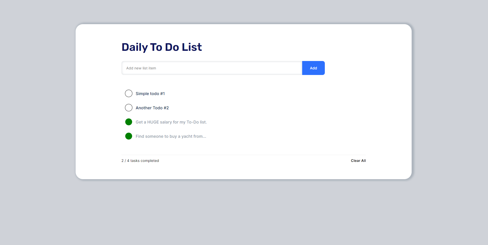

<span styles='font-size=16px'>

# SimpleToDo

[](https://simple-to-do-psi.vercel.app/)

## About
SimpleToDo is a web application for managing to-do items. It allows users to create, read, update, and delete to-do items in a list. The application is built using:

- HTML5 / CSS3
- SASS(SCSS)
- TypeScript 
- React 
- Redux (RTK) 
- Axios 
- React-hook-form 

## Getting Started
To get started with SimpleToDo, just follow [THIS](https://simple-to-do-psi.vercel.app/)
 link, or follow the instructions below to deploy the project to a local server:

1. **Clone the repository**: Clone the SimpleToDo repository to your local machine using the following command: 
    ```bash 
    git clone https://github.com/nenaideno/SimpleToDo.git
    ```
2. **Install dependencies**: Navigate to the project directory and install the dependencies using npm or yarn, like so:
    ```bash 
    cd SimpleToDo
    npm install
    ```
    or
    ```bash
    cd SimpleToDo
    yarn install
    ```
3. If you want to make sure all dependencies are **up to date**, you can also run `update`:
    ```bash
    cd SimpleToDo
    npm update
    ```
    or
    ```bash
    cd SimpleToDo
    yarn update
    ```
3. **Run the application**: Once the dependencies are installed, you can run the application locally by running the following command:
    ```bash
    npm start
    ```
    or
    
    ```bash
    yarn start
    ```
    This will start the development server and open the application in your default web browser.
</span>


